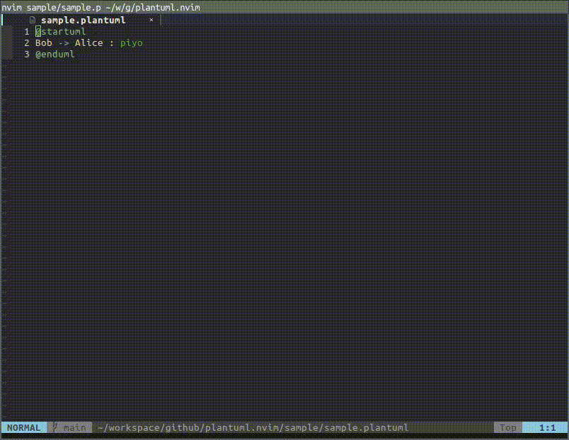

# plantuml.nvim

A Neovim plugin for generating and previewing PlantUML diagrams directly within Neovim. This plugin allows users to preview ASCII representations of diagrams and export them to various formats (e.g., PNG, SVG).



## Features

- Render PlantUML diagrams as ASCII in a window within Neovim.
- Export diagrams to specified formats (PNG, SVG, etc.).
- Automatic preview reload on file save events.
- Configurable viewer for image exports.

## Requirements

- [curl](https://curl.se/): for downloading the generated diagrams.

## Installation

lazy.nvim

```lua
  {
    'goropikari/plantuml.nvim',
    opts = {
      -- default opts
      base_url = 'https://www.plantuml.com/plantuml',
      reload_events = { 'BufWritePre' },
      viewer = 'xdg-open', -- Image viewer for non-ASCII exports
      docker_image = 'plantuml/plantuml-server:tomcat'
    },
  },
```

## Usage
### Commands

- `:PlantumlPreview [format]`: Preview the diagram in ASCII or export it to a specified format.
  - `:PlantumlPreview ascii`: Preview the ASCII rendering in a floating window.
  - `:PlantumlPreview png`: Export the diagram as a PNG file and open it with the specified viewer.
  - Supports PNG, SVG, and other formats.
- `:PlantumlExport [format] [path]`: Export the current diagram to a specified format and path.
  - `:PlantumlExport png ~/diagrams/diagram.png`: Export as PNG to `~/diagrams/diagram.png`.
  - `:PlantumlExport svg`: Export as SVG and print the path in Neovim.
- `:PlantumlStartDocker`: Start plantuml container.

## Troubleshoot

If hererocks build fails, install a readline.

```bash
sudo apt install libreadline-dev
```

Clean this plugin and restart neovim to reinstall this plugin.

ref: https://github.com/folke/lazy.nvim/issues/1548#issuecomment-2188183020

## Alternative

- https://github.com/iamcco/markdown-preview.nvim
- https://github.com/javiorfo/nvim-soil
- https://github.com/weirongxu/plantuml-previewer.vim
- https://github.com/skanehira/preview-uml.vim
- https://gitlab.com/itaranto/plantuml.nvim
